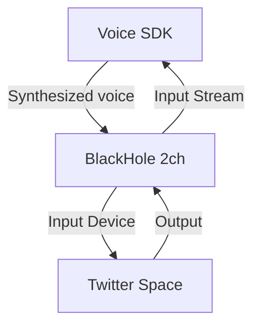

# Voice SDK Integration with Twitter Space

## Current Components
1. SDK components:
   - AudioClient - audio processing via AudioWorklet
   - CallManager - call management
   - WebSocket connection for audio streaming

2. Current workflow:
   ```
   Microphone -> AudioWorklet -> WebSocket -> API -> WebSocket -> AudioWorklet -> Speakers
   ```

## Objective
Replace the physical microphone with BlackHole virtual device to:
- Allow Twitter Space to receive audio from our SDK
- Enable SDK to receive audio from other Space participants

## Solution

### 1. BlackHole Installation
```bash
brew install blackhole-2ch
sudo launchctl kickstart -k system/com.apple.audio.coreaudiod
```

### 2. Architecture


### 3. Code Modifications
Minimal changes to existing code:

```javascript
// 1. Modify AudioClient to work with BlackHole
class BlackHoleAudioClient extends AudioClient {
    async setupAudio() {
        // Find BlackHole device
        const devices = await navigator.mediaDevices.enumerateDevices();
        const blackhole = devices.find(device => 
            device.label.includes('BlackHole 2ch')
        );

        // Use BlackHole instead of microphone
        this.stream = await navigator.mediaDevices.getUserMedia({
            audio: {
                deviceId: { exact: blackhole.deviceId },
                echoCancellation: false,
                noiseSuppression: false
            }
        });

        // Rest of the code remains unchanged
        await super.setupAudio();
    }
}

// 2. Modify CallManager
class BlackHoleCallManager extends CallManager {
    async handleCall(key, partner, character) {
        // Use BlackHoleAudioClient instead of regular one
        this.client = new BlackHoleAudioClient(...);
        await super.handleCall(key, partner, character);
    }
}
```

### 4. Implementation

```html
<!DOCTYPE html>
<html>
<body>
    <button id="callButton">Start Space Bridge</button>
    <button id="hangUpButton">Stop</button>
    <div id="status"></div>

    <script>
        const callbacks = {
            onStatusUpdate: (status) => {
                document.getElementById('status').textContent = status;
            },
            onCallStart: () => { /* ... */ },
            onCallError: () => { /* ... */ },
            onHangUp: () => { /* ... */ }
        };

        const callManager = new BlackHoleCallManager(callbacks);

        document.getElementById('callButton').onclick = () => {
            callManager.handleCall(KEY, PARTNER, CHARACTER);
        };
    </script>
</body>
</html>
```

### 5. Workflow Process

1. **Initialization**
   - Verify BlackHole presence
   - Create AudioContext
   - Load AudioWorklet

2. **Incoming Stream (participants -> SDK)**
   ```
   Twitter Space Output -> BlackHole -> AudioWorklet -> SDK Processing
   ```

3. **Outgoing Stream (SDK -> participants)**
   ```
   SDK Generated Audio -> AudioWorklet -> BlackHole -> Twitter Space Input
   ```

### 6. Solution Benefits

1. **Minimal Changes**
   - Preserves existing SDK logic
   - Only replaces audio source/sink

2. **Reliability**
   - Uses proven BlackHole implementation
   - Maintains existing error handling

3. **Simplicity**
   - No additional servers required
   - Minimal configuration needed

4. **Extensibility**
   - Allows for audio processing additions
   - Easy to modify for other platforms

### 7. Implementation Steps

1. **Installation**
   ```bash
   brew install blackhole-2ch
   ```

2. **Twitter Space Setup**
   - Open Twitter
   - Create Space
   - Select BlackHole 2ch in audio settings

3. **Bridge Launch**
   - Open HTML page
   - Click Start
   - SDK automatically connects via BlackHole

4. **Verification**
   - Speaking in Space -> Heard in SDK
   - SDK generates response -> Heard in Space

### 8. Debugging

```javascript
// Add logging
this.audioNode.port.onmessage = (e) => {
    if (Array.isArray(e.data)) {
        const [eventType, audioData] = e.data;
        console.log(`Audio event: ${eventType}, size: ${audioData?.length}`);
    }
};
```

### 9. Troubleshooting

1. **BlackHole Not Visible**
   ```bash
   sudo launchctl kickstart -k system/com.apple.audio.coreaudiod
   ```

2. **Audio Quality Issues**
   - Check sampling rate settings
   - Ensure echo cancellation and noise suppression are disabled
